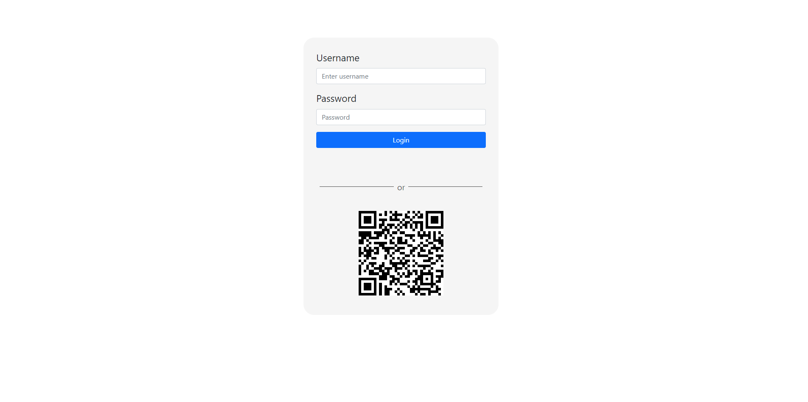
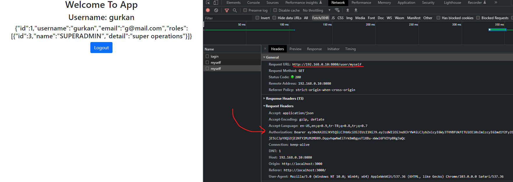

# QR Code Login - Frontend

#### Gurkan UCAR

&nbsp;


### Used Packages

**sockjs-client & stompjs & net:** for connecting to stomp socket

**redux** : storing global state

**React Bootstrap:** ui package

&nbsp;

### How to run

#### clone the project: https://github.com/gurkanucar/qr-login-fe.git

```bash
  git clone https://github.com/gurkanucar/qr-login-fe.git
  cd qr-login-fe
```

 #### install the packages

```bash
  npm install
```

#### run
    
```bash
  npm start
```

#### User credentials for testing
```bash
   username: gurkan
   password: password
```

 ### dont forget to change backend url !
 #### /src/constants
 #### export const BASE_URL = "http://[IP ADDRESS]:8080";


## Example Images






